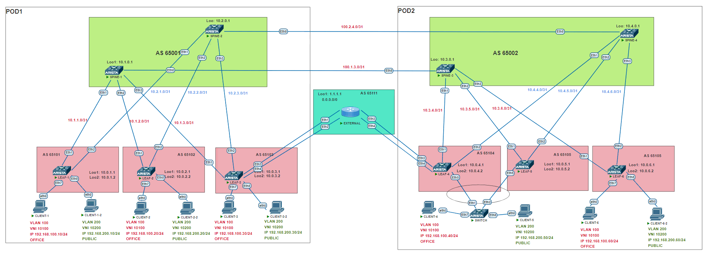

# Проектная работа

## Тема: Отработка навыков постороения сетей ЦОД с использованием EVPN/VXLAN в схеме MultiPod

### Цели:

- Отработка навыков построения сети ЦОД с топологией CLOS, с использования VXLAN/EVPN, для дальнейшей модернизации сетевой инфраструктуры.
- Научиться использовать ESI LAG вместо MLAG
- Переход от схемы с использованием L2 каналов между ЦОД на схему “multipod”

## План:

- Проектирование адресного пространства
- Проектирование Underlay и Overlay сетей
- Разработка отказоустойчивой и масштабируемой топологии CLOS.
- Проектирование DCI с помощью “multi-pod”
- Обеспечение безопасности при передачи информации между VRF

### [Презинтация проекта](file/presentation.pptx)


### Схема проектируемой сети



### Конфигурация оборудования

#### POD 1
- [LEAF-1](conf/LEAF-1.conf)
- [LEAF-2](conf/LEAF-2.conf)
- [LEAF-3](conf/LEAF-3.conf)
- [SPINE-1](conf/SPINE-1.conf)
- [SPINE-2](conf/SPINE-2.conf)

#### POD 2
- [LEAF-4](conf/LEAF-4.conf)
- [LEAF-5](conf/LEAF-5.conf)
- [LEAF-6](conf/LEAF-6.conf)
- [SPINE-3](conf/SPINE-3.conf)
- [SPINE-4](conf/SPINE-4.conf)
- [SWITCH](conf/SWITCH.conf)

#### EXT
- [EXTERNAL](conf/EXTERNAL.conf)


### Проверка связности клиентов 

#### CLIENT-1

```
VPCS> ping 192.168.100.20 -c 2

84 bytes from 192.168.100.20 icmp_seq=1 ttl=64 time=344.636 ms
84 bytes from 192.168.100.20 icmp_seq=2 ttl=64 time=96.484 ms

VPCS> ping 192.168.200.20 -c 2

84 bytes from 192.168.200.20 icmp_seq=1 ttl=60 time=491.515 ms
84 bytes from 192.168.200.20 icmp_seq=2 ttl=60 time=191.236 ms

VPCS> ping 192.168.100.30 -c 2

84 bytes from 192.168.100.30 icmp_seq=1 ttl=64 time=300.242 ms
84 bytes from 192.168.100.30 icmp_seq=2 ttl=64 time=94.148 ms

VPCS> ping 192.168.200.30 -c 2

84 bytes from 192.168.200.30 icmp_seq=1 ttl=60 time=232.726 ms
84 bytes from 192.168.200.30 icmp_seq=2 ttl=60 time=109.750 ms

VPCS> ping 192.168.100.40 -c 2

84 bytes from 192.168.100.40 icmp_seq=1 ttl=64 time=134.629 ms
84 bytes from 192.168.100.40 icmp_seq=2 ttl=64 time=110.743 ms

VPCS> ping 192.168.200.50 -c 2

84 bytes from 192.168.200.50 icmp_seq=1 ttl=59 time=513.753 ms
84 bytes from 192.168.200.50 icmp_seq=2 ttl=59 time=173.010 ms

VPCS> ping 192.168.100.60 -c 2

84 bytes from 192.168.100.60 icmp_seq=1 ttl=64 time=243.063 ms
84 bytes from 192.168.100.60 icmp_seq=2 ttl=64 time=93.948 ms

VPCS> ping 192.168.200.60 -c 2

84 bytes from 192.168.200.60 icmp_seq=1 ttl=60 time=420.768 ms
84 bytes from 192.168.200.60 icmp_seq=2 ttl=60 time=148.586 ms

VPCS> ping 1.1.1.1

84 bytes from 1.1.1.1 icmp_seq=1 ttl=62 time=47.729 ms
84 bytes from 1.1.1.1 icmp_seq=2 ttl=62 time=54.689 ms
84 bytes from 1.1.1.1 icmp_seq=3 ttl=62 time=67.269 ms
84 bytes from 1.1.1.1 icmp_seq=4 ttl=62 time=67.750 ms
84 bytes from 1.1.1.1 icmp_seq=5 ttl=62 time=60.231 ms
```


```
SPINE-1#sho ip ro


 B E      10.0.1.1/32 [200/0] via 10.1.1.1, Ethernet1
 B E      10.0.1.2/32 [200/0] via 10.1.1.1, Ethernet1
 B E      10.0.2.1/32 [200/0] via 10.1.2.1, Ethernet2
 B E      10.0.2.2/32 [200/0] via 10.1.2.1, Ethernet2
 B E      10.0.3.1/32 [200/0] via 10.1.3.1, Ethernet3
 B E      10.0.3.2/32 [200/0] via 10.1.3.1, Ethernet3
 B E      10.0.4.1/32 [200/0] via 100.1.3.1, Ethernet8
 B E      10.0.4.2/32 [200/0] via 100.1.3.1, Ethernet8
 B E      10.0.5.1/32 [200/0] via 100.1.3.1, Ethernet8
 B E      10.0.5.2/32 [200/0] via 100.1.3.1, Ethernet8
 B E      10.0.6.1/32 [200/0] via 100.1.3.1, Ethernet8
 B E      10.0.6.2/32 [200/0] via 100.1.3.1, Ethernet8
 C        10.1.0.1/32 is directly connected, Loopback1
 C        10.1.0.2/32 is directly connected, Loopback2
 C        10.1.1.0/31 is directly connected, Ethernet1
 C        10.1.2.0/31 is directly connected, Ethernet2
 C        10.1.3.0/31 is directly connected, Ethernet3
 B E      10.3.0.1/32 [200/0] via 100.1.3.1, Ethernet8
 B E      10.4.0.1/32 [200/0] via 100.1.3.1, Ethernet8
 C        100.1.3.0/31 is directly connected, Ethernet8

SPINE-1#sho bgp evpn sum
BGP summary information for VRF default
Router identifier 10.1.0.1, local AS number 65001
Neighbor Status Codes: m - Under maintenance
  Neighbor V AS           MsgRcvd   MsgSent  InQ OutQ  Up/Down State   PfxRcd PfxAcc
  10.0.1.1 4 65101          24670     24660    0    0 16:52:52 Estab   22     22
  10.0.2.1 4 65102          24731     24670    0    0 16:52:52 Estab   26     26
  10.0.3.1 4 65103          24689     24613    0    0 16:52:52 Estab   35     35
  10.0.4.1 4 65104          24627     24595    0    0 16:52:52 Estab   36     36
  10.0.5.1 4 65105          24613     24575    0    0 16:52:52 Estab   35     35
  10.0.6.1 4 65106          24675     24672    0    0 16:52:52 Estab   39     39

```

```

LEAF-1#sho vxlan vtep 
Remote VTEPS for Vxlan1:

VTEP           Tunnel Type(s)
-------------- --------------
10.0.2.2       flood, unicast
10.0.3.2       flood, unicast
10.0.4.2       flood, unicast
10.0.5.2       flood, unicast
10.0.6.2       flood, unicast

LEAF-1#sho bgp evpn

          Network                Next Hop              Metric  LocPref Weight  Path
 * >Ec    RD: 65104:10100 auto-discovery 0 0011:1111:1111:1100:0000
                                 10.0.4.2              -       100     0       65002 65104 i
 *  ec    RD: 65104:10100 auto-discovery 0 0011:1111:1111:1100:0000
                                 10.0.4.2              -       100     0       65002 65104 i
 *  ec    RD: 65104:10100 auto-discovery 0 0011:1111:1111:1100:0000
                                 10.0.4.2              -       100     0       65001 65104 i
 *  ec    RD: 65104:10100 auto-discovery 0 0011:1111:1111:1100:0000
                                 10.0.4.2              -       100     0       65001 65104 i
 * >Ec    RD: 65104:10200 auto-discovery 0 0011:1111:1111:1100:0000
                                 10.0.4.2              -       100     0       65001 65104 i
 *  ec    RD: 65104:10200 auto-discovery 0 0011:1111:1111:1100:0000
                                 10.0.4.2              -       100     0       65002 65104 i
 *  ec    RD: 65104:10200 auto-discovery 0 0011:1111:1111:1100:0000
                                 10.0.4.2              -       100     0       65001 65104 i
 *  ec    RD: 65104:10200 auto-discovery 0 0011:1111:1111:1100:0000
                                 10.0.4.2              -       100     0       65002 65104 i
 * >Ec    RD: 65105:10100 auto-discovery 0 0011:1111:1111:1100:0000
                                 10.0.5.2              -       100     0       65002 65105 i
 *  ec    RD: 65105:10100 auto-discovery 0 0011:1111:1111:1100:0000
                                 10.0.5.2              -       100     0       65001 65105 i
 *  ec    RD: 65105:10100 auto-discovery 0 0011:1111:1111:1100:0000
                                 10.0.5.2              -       100     0       65001 65105 i
 *  ec    RD: 65105:10100 auto-discovery 0 0011:1111:1111:1100:0000
                                 10.0.5.2              -       100     0       65002 65105 i
 * >Ec    RD: 65105:10200 auto-discovery 0 0011:1111:1111:1100:0000
                                 10.0.5.2              -       100     0       65002 65105 i
 *  ec    RD: 65105:10200 auto-discovery 0 0011:1111:1111:1100:0000
                                 10.0.5.2              -       100     0       65001 65105 i
 *  ec    RD: 65105:10200 auto-discovery 0 0011:1111:1111:1100:0000
                                 10.0.5.2              -       100     0       65002 65105 i
 *  ec    RD: 65105:10200 auto-discovery 0 0011:1111:1111:1100:0000
                                 10.0.5.2              -       100     0       65001 65105 i
 * >Ec    RD: 10.0.4.2:1 auto-discovery 0011:1111:1111:1100:0000
                                 10.0.4.2              -       100     0       65001 65104 i
 *  ec    RD: 10.0.4.2:1 auto-discovery 0011:1111:1111:1100:0000
                                 10.0.4.2              -       100     0       65002 65104 i
 *  ec    RD: 10.0.4.2:1 auto-discovery 0011:1111:1111:1100:0000
                                 10.0.4.2              -       100     0       65001 65104 i
 *  ec    RD: 10.0.4.2:1 auto-discovery 0011:1111:1111:1100:0000
                                 10.0.4.2              -       100     0       65002 65104 i
 * >Ec    RD: 10.0.5.2:1 auto-discovery 0011:1111:1111:1100:0000
                                 10.0.5.2              -       100     0       65002 65105 i
 *  ec    RD: 10.0.5.2:1 auto-discovery 0011:1111:1111:1100:0000
                                 10.0.5.2              -       100     0       65001 65105 i
 *  ec    RD: 10.0.5.2:1 auto-discovery 0011:1111:1111:1100:0000
                                 10.0.5.2              -       100     0       65001 65105 i
 *  ec    RD: 10.0.5.2:1 auto-discovery 0011:1111:1111:1100:0000
                                 10.0.5.2              -       100     0       65002 65105 i
 * >Ec    RD: 65105:10100 mac-ip 0050.7966.6846
                                 10.0.5.2              -       100     0       65001 65105 i
 *  ec    RD: 65105:10100 mac-ip 0050.7966.6846
                                 10.0.5.2              -       100     0       65002 65105 i
 *  ec    RD: 65105:10100 mac-ip 0050.7966.6846
                                 10.0.5.2              -       100     0       65002 65105 i
 *  ec    RD: 65105:10100 mac-ip 0050.7966.6846
                                 10.0.5.2              -       100     0       65001 65105 i
 * >Ec    RD: 65104:10100 mac-ip 0050.7966.6846 192.168.100.40
                                 10.0.4.2              -       100     0       65001 65104 i
 *  ec    RD: 65104:10100 mac-ip 0050.7966.6846 192.168.100.40
                                 10.0.4.2              -       100     0       65001 65104 i
 *  ec    RD: 65104:10100 mac-ip 0050.7966.6846 192.168.100.40
                                 10.0.4.2              -       100     0       65002 65104 i
 *  ec    RD: 65104:10100 mac-ip 0050.7966.6846 192.168.100.40
                                 10.0.4.2              -       100     0       65002 65104 i
 * >Ec    RD: 65105:10100 mac-ip 0050.7966.6846 192.168.100.40
                                 10.0.5.2              -       100     0       65001 65105 i
*  ec    RD: 65105:10100 mac-ip 0050.7966.6846 192.168.100.40
                                 10.0.5.2              -       100     0       65002 65105 i
 *  ec    RD: 65105:10100 mac-ip 0050.7966.6846 192.168.100.40
                                 10.0.5.2              -       100     0       65002 65105 i
 *  ec    RD: 65105:10100 mac-ip 0050.7966.6846 192.168.100.40
                                 10.0.5.2              -       100     0       65001 65105 i
 * >Ec    RD: 65105:10200 mac-ip 0050.7966.6847
                                 10.0.5.2              -       100     0       65002 65105 i
 *  ec    RD: 65105:10200 mac-ip 0050.7966.6847
                                 10.0.5.2              -       100     0       65002 65105 i
 *  ec    RD: 65105:10200 mac-ip 0050.7966.6847
                                 10.0.5.2              -       100     0       65001 65105 i
 *  ec    RD: 65105:10200 mac-ip 0050.7966.6847
                                 10.0.5.2              -       100     0       65001 65105 i
 * >Ec    RD: 65104:10200 mac-ip 0050.7966.6847 192.168.200.40
                                 10.0.4.2              -       100     0       65002 65104 i
 *  ec    RD: 65104:10200 mac-ip 0050.7966.6847 192.168.200.40
                                 10.0.4.2              -       100     0       65001 65104 i
 *  ec    RD: 65104:10200 mac-ip 0050.7966.6847 192.168.200.40
                                 10.0.4.2              -       100     0       65001 65104 i
 *  ec    RD: 65104:10200 mac-ip 0050.7966.6847 192.168.200.40
                                 10.0.4.2              -       100     0       65002 65104 i
 * >Ec    RD: 65105:10200 mac-ip 0050.7966.6847 192.168.200.40
                                 10.0.5.2              -       100     0       65002 65105 i
 *  ec    RD: 65105:10200 mac-ip 0050.7966.6847 192.168.200.40
                                 10.0.5.2              -       100     0       65002 65105 i
 *  ec    RD: 65105:10200 mac-ip 0050.7966.6847 192.168.200.40
                                 10.0.5.2              -       100     0       65001 65105 i
 *  ec    RD: 65105:10200 mac-ip 0050.7966.6847 192.168.200.40
                                 10.0.5.2              -       100     0       65001 65105 i
 * >Ec    RD: 65104:10200 mac-ip 0050.7966.6847 192.168.200.50
                                 10.0.4.2              -       100     0       65001 65104 i
 *  ec    RD: 65104:10200 mac-ip 0050.7966.6847 192.168.200.50
                                 10.0.4.2              -       100     0       65001 65104 i
 *  ec    RD: 65104:10200 mac-ip 0050.7966.6847 192.168.200.50
                                 10.0.4.2              -       100     0       65002 65104 i
 *  ec    RD: 65104:10200 mac-ip 0050.7966.6847 192.168.200.50
                                 10.0.4.2              -       100     0       65002 65104 i
 * >Ec    RD: 65105:10200 mac-ip 0050.7966.6847 192.168.200.50
                                 10.0.5.2              -       100     0       65002 65105 i
 *  ec    RD: 65105:10200 mac-ip 0050.7966.6847 192.168.200.50
                                 10.0.5.2              -       100     0       65002 65105 i
 *  ec    RD: 65105:10200 mac-ip 0050.7966.6847 192.168.200.50
                                 10.0.5.2              -       100     0       65001 65105 i
 *  ec    RD: 65105:10200 mac-ip 0050.7966.6847 192.168.200.50
                                 10.0.5.2              -       100     0       65001 65105 i
 * >Ec    RD: 65104:10100 mac-ip 501d.a013.90a0
                                 10.0.4.2              -       100     0       65001 65104 i
 *  ec    RD: 65104:10100 mac-ip 501d.a013.90a0
                                 10.0.4.2              -       100     0       65002 65104 i
 *  ec    RD: 65104:10100 mac-ip 501d.a013.90a0
                                 10.0.4.2              -       100     0       65001 65104 i
 *  ec    RD: 65104:10100 mac-ip 501d.a013.90a0
                                 10.0.4.2              -       100     0       65002 65104 i
 * >Ec    RD: 65104:10100 mac-ip 501d.a013.90a0 192.168.100.2
                                 10.0.4.2              -       100     0       65001 65104 i
 *  ec    RD: 65104:10100 mac-ip 501d.a013.90a0 192.168.100.2
                                 10.0.4.2              -       100     0       65002 65104 i
 *  ec    RD: 65104:10100 mac-ip 501d.a013.90a0 192.168.100.2
                                 10.0.4.2              -       100     0       65001 65104 i
 *  ec    RD: 65104:10100 mac-ip 501d.a013.90a0 192.168.100.2
                                 10.0.4.2              -       100     0       65002 65104 i
 * >Ec    RD: 65105:10100 mac-ip 501d.a013.90a0 192.168.100.2
                                 10.0.5.2              -       100     0       65002 65105 i
 *  ec    RD: 65105:10100 mac-ip 501d.a013.90a0 192.168.100.2
                                 10.0.5.2              -       100     0       65001 65105 i
 *  ec    RD: 65105:10100 mac-ip 501d.a013.90a0 192.168.100.2
                                 10.0.5.2              -       100     0       65002 65105 i
 *  ec    RD: 65105:10100 mac-ip 501d.a013.90a0 192.168.100.2
                                 10.0.5.2              -       100     0       65001 65105 i
 
                                 10.0.6.2              -       100     0       65001 65106 i
 * >Ec    RD: 10.0.4.2:1 ethernet-segment 0011:1111:1111:1100:0000 10.0.4.2
                                 10.0.4.2              -       100     0       65001 65104 i
 *  ec    RD: 10.0.4.2:1 ethernet-segment 0011:1111:1111:1100:0000 10.0.4.2
                                 10.0.4.2              -       100     0       65002 65104 i
 *  ec    RD: 10.0.4.2:1 ethernet-segment 0011:1111:1111:1100:0000 10.0.4.2
                                 10.0.4.2              -       100     0       65002 65104 i
 *  ec    RD: 10.0.4.2:1 ethernet-segment 0011:1111:1111:1100:0000 10.0.4.2
                                 10.0.4.2              -       100     0       65001 65104 i
 * >Ec    RD: 10.0.5.2:1 ethernet-segment 0011:1111:1111:1100:0000 10.0.5.2
                                 10.0.5.2              -       100     0       65001 65105 i
 *  ec    RD: 10.0.5.2:1 ethernet-segment 0011:1111:1111:1100:0000 10.0.5.2
                                 10.0.5.2              -       100     0       65002 65105 i
 *  ec    RD: 10.0.5.2:1 ethernet-segment 0011:1111:1111:1100:0000 10.0.5.2
                                 10.0.5.2              -       100     0       65001 65105 i
 *  ec    RD: 10.0.5.2:1 ethernet-segment 0011:1111:1111:1100:0000 10.0.5.2
                                
 * >Ec    RD: 65103:11 ip-prefix 0.0.0.0/0
                                 10.0.3.2              -       100     0       65001 65103 65111 ?
 *  ec    RD: 65103:11 ip-prefix 0.0.0.0/0
                                 10.0.3.2              -       100     0       65002 65103 65111 ?
 *  ec    RD: 65103:11 ip-prefix 0.0.0.0/0
                                 10.0.3.2              -       100     0       65001 65103 65111 ?
 *  ec    RD: 65103:11 ip-prefix 0.0.0.0/0
                                 10.0.3.2              -       100     0       65002 65103 65111 ?
 * >Ec    RD: 65103:12 ip-prefix 0.0.0.0/0
                                 10.0.3.2              -       100     0       65001 65103 65111 ?
 *  ec    RD: 65103:12 ip-prefix 0.0.0.0/0
                                 10.0.3.2              -       100     0       65002 65103 65111 ?
 *  ec    RD: 65103:12 ip-prefix 0.0.0.0/0
                                 10.0.3.2              -       100     0       65001 65103 65111 ?
 *  ec    RD: 65103:12 ip-prefix 0.0.0.0/0
                                 10.0.3.2              -       100     0       65002 65103 65111 ?
 * >Ec    RD: 65103:11 ip-prefix 1.1.1.1/32
                                 10.0.3.2              -       100     0       65001 65103 65111 i
 *  ec    RD: 65103:11 ip-prefix 1.1.1.1/32
                                 10.0.3.2              -       100     0       65002 65103 65111 i
 *  ec    RD: 65103:11 ip-prefix 1.1.1.1/32
                                10.0.3.2              -       100     0       65001 65103 65111 i
 *  ec    RD: 65103:11 ip-prefix 1.1.1.1/32
                                 10.0.3.2              -       100     0       65002 65103 65111 i
 * >Ec    RD: 65103:12 ip-prefix 1.1.1.1/32
                                 10.0.3.2              -       100     0       65001 65103 65111 i
 *  ec    RD: 65103:12 ip-prefix 1.1.1.1/32
                                 10.0.3.2              -       100     0       65002 65103 65111 i
 *  ec    RD: 65103:12 ip-prefix 1.1.1.1/32
                                 10.0.3.2              -       100     0       65001 65103 65111 i
 *  ec    RD: 65103:12 ip-prefix 1.1.1.1/32
                                 10.0.3.2              -       100     0       65002 65103 65111 i
 * >Ec    RD: 65103:11 ip-prefix 10.0.0.0/31
                                 10.0.3.2              -       100     0       65001 65103 i
 *  ec    RD: 65103:11 ip-prefix 10.0.0.0/31
                                 10.0.3.2              -       100     0       65002 65103 i
 *  ec    RD: 65103:11 ip-prefix 10.0.0.0/31
                                 10.0.3.2              -       100     0       65001 65103 i
 *  ec    RD: 65103:11 ip-prefix 10.0.0.0/31
                                 10.0.3.2              -       100     0       65002 65103 i
 * >Ec    RD: 65103:12 ip-prefix 10.0.0.0/31
                                 10.0.3.2              -       100     0       65001 65103 65111 i
 *  ec    RD: 65103:12 ip-prefix 10.0.0.0/31
                                 10.0.3.2              -       100     0       65002 65103 65111 i
 *  ec    RD: 65103:12 ip-prefix 10.0.0.0/31
                                 10.0.3.2              -       100     0       65001 65103 65111 i
 *  ec    RD: 65103:12 ip-prefix 10.0.0.0/31
                                 10.0.3.2              -       100     0       65002 65103 65111 i
 * >Ec    RD: 65103:11 ip-prefix 10.0.0.2/31
                                 10.0.3.2              -       100     0       65001 65103 65111 i
 *  ec    RD: 65103:11 ip-prefix 10.0.0.2/31
                                 10.0.3.2              -       100     0       65002 65103 65111 i
 *  ec    RD: 65103:11 ip-prefix 10.0.0.2/31
                                 10.0.3.2              -       100     0       65001 65103 65111 i
 *  ec    RD: 65103:11 ip-prefix 10.0.0.2/31
                                 10.0.3.2              -       100     0       65002 65103 65111 i
 * >Ec    RD: 65103:12 ip-prefix 10.0.0.2/31
                                 10.0.3.2              -       100     0       65001 65103 i
 *  ec    RD: 65103:12 ip-prefix 10.0.0.2/31
                                 10.0.3.2              -       100     0       65002 65103 i
 *  ec    RD: 65103:12 ip-prefix 10.0.0.2/31
                                 10.0.3.2              -       100     0       65001 65103 i
 *  ec    RD: 65103:12 ip-prefix 10.0.0.2/31
                                 10.0.3.2              -       100     0       65002 65103 i
 * >      RD: 65101:11 ip-prefix 192.168.100.0/24
                                 -                     -       -       0       i
 * >Ec    RD: 65102:11 ip-prefix 192.168.100.0/24
                                 10.0.2.2              -       100     0       65002 65102 i
 *  ec    RD: 65102:11 ip-prefix 192.168.100.0/24
                                 10.0.2.2              -       100     0       65002 65102 i
 *  ec    RD: 65102:11 ip-prefix 192.168.100.0/24
                                 10.0.2.2              -       100     0       65001 65102 i
 *  ec    RD: 65102:11 ip-prefix 192.168.100.0/24
                                 10.0.2.2              -       100     0       65001 65102 i
 * >Ec    RD: 65103:11 ip-prefix 192.168.100.0/24
                                 10.0.3.2              -       100     0       65001 65103 i
 *  ec    RD: 65103:11 ip-prefix 192.168.100.0/24
                                 10.0.3.2              -       100     0       65002 65103 i
 *  ec    RD: 65103:11 ip-prefix 192.168.100.0/24
                                 10.0.3.2              -       100     0       65001 65103 i
 *  ec    RD: 65103:11 ip-prefix 192.168.100.0/24
                                 10.0.3.2              -       100     0       65002 65103 i
 * >Ec    RD: 65104:11 ip-prefix 192.168.100.0/24
                                 10.0.4.2              -       100     0       65002 65104 i
 *  ec    RD: 65104:11 ip-prefix 192.168.100.0/24
                                 10.0.4.2              -       100     0       65002 65104 i
 *  ec    RD: 65104:11 ip-prefix 192.168.100.0/24
                                 10.0.4.2              -       100     0       65001 65104 i
 *  ec    RD: 65104:11 ip-prefix 192.168.100.0/24
                                 10.0.4.2              -       100     0       65001 65104 i
 * >Ec    RD: 65105:11 ip-prefix 192.168.100.0/24
                                 10.0.5.2              -       100     0       65001 65105 i
 *  ec    RD: 65105:11 ip-prefix 192.168.100.0/24
                                 10.0.5.2              -       100     0       65002 65105 i
 *  ec    RD: 65105:11 ip-prefix 192.168.100.0/24
                                 10.0.5.2              -       100     0       65001 65105 i
 *  ec    RD: 65105:11 ip-prefix 192.168.100.0/24
                                 10.0.5.2              -       100     0       65002 65105 i
 * >Ec    RD: 65106:11 ip-prefix 192.168.100.0/24
                                 10.0.6.2              -       100     0       65002 65106 i
 *  ec    RD: 65106:11 ip-prefix 192.168.100.0/24
                                 10.0.6.2              -       100     0       65002 65106 i
 *  ec    RD: 65106:11 ip-prefix 192.168.100.0/24
                                 10.0.6.2              -       100     0       65001 65106 i
 *  ec    RD: 65106:11 ip-prefix 192.168.100.0/24
                                 10.0.6.2              -       100     0       65001 65106 i
 * >      RD: 65101:12 ip-prefix 192.168.200.0/24
                                 -                     -       -       0       i
 * >Ec    RD: 65102:12 ip-prefix 192.168.200.0/24
                                 10.0.2.2              -       100     0       65002 65102 i
 *  ec    RD: 65102:12 ip-prefix 192.168.200.0/24
                                 10.0.2.2              -       100     0       65002 65102 i
 *  ec    RD: 65102:12 ip-prefix 192.168.200.0/24
                                 10.0.2.2              -       100     0       65001 65102 i
 *  ec    RD: 65102:12 ip-prefix 192.168.200.0/24
                                 10.0.2.2              -       100     0       65001 65102 i
 * >Ec    RD: 65103:12 ip-prefix 192.168.200.0/24
                                 10.0.3.2              -       100     0       65001 65103 i
 *  ec    RD: 65103:12 ip-prefix 192.168.200.0/24
                                 10.0.3.2              -       100     0       65002 65103 i
 *  ec    RD: 65103:12 ip-prefix 192.168.200.0/24
                                 10.0.3.2              -       100     0       65001 65103 i
 *  ec    RD: 65103:12 ip-prefix 192.168.200.0/24
                                 10.0.3.2              -       100     0       65002 65103 i
 * >Ec    RD: 65104:12 ip-prefix 192.168.200.0/24
                                 10.0.4.2              -       100     0       65002 65104 i
 *  ec    RD: 65104:12 ip-prefix 192.168.200.0/24
                                 10.0.4.2              -       100     0       65002 65104 i
 *  ec    RD: 65104:12 ip-prefix 192.168.200.0/24
                                 10.0.4.2              -       100     0       65001 65104 i
 *  ec    RD: 65104:12 ip-prefix 192.168.200.0/24
                                 10.0.4.2              -       100     0       65001 65104 i
 * >Ec    RD: 65105:12 ip-prefix 192.168.200.0/24
                                 10.0.5.2              -       100     0       65001 65105 i
 *  ec    RD: 65105:12 ip-prefix 192.168.200.0/24
                                 10.0.5.2              -       100     0       65002 65105 i
 *  ec    RD: 65105:12 ip-prefix 192.168.200.0/24
                                 10.0.5.2              -       100     0       65001 65105 i
 *  ec    RD: 65105:12 ip-prefix 192.168.200.0/24
                                 10.0.5.2              -       100     0       65002 65105 i
 * >Ec    RD: 65106:12 ip-prefix 192.168.200.0/24
                                 10.0.6.2              -       100     0       65002 65106 i
 *  ec    RD: 65106:12 ip-prefix 192.168.200.0/24
                                 10.0.6.2              -       100     0       65002 65106 i
 *  ec    RD: 65106:12 ip-prefix 192.168.200.0/24
                                 10.0.6.2              -       100     0       65001 65106 i
 *  ec    RD: 65106:12 ip-prefix 192.168.200.0/24
                                 10.0.6.2              -       100     0       65001 65106 i
```
