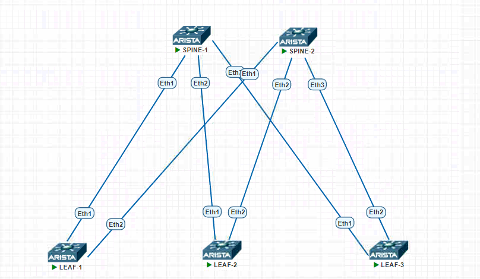

## СХЕМА:



## 		IPAM

| Hostname | Interface | IP | Description |
| :------: | :-------: | :----------: | :---------: |
| SPINE-1 | Loop1 | 10.1.0.1 | Underlay |
| SPINE-1 | Loop2 | 10.1.0.2 | Overlay |
| SPINE-1 | Eth1 | 10.1.1.0/31 | TO_LEAF-1 |
| SPINE-1 | Eth2 | 10.1.2.0/31 | TO_LEAF-2 |
| SPINE-1 | Eth3 | 10.1.3.0/31 | TO_LEAF-3 |
|          |          |              |            |
| SPINE-2 | Loop1 | 10.2.0.1 | Underlay |
| SPINE-2 | Loop2 | 10.2.0.2 | Overlay |
| SPINE-2 | Eth1 | 10.2.1.0/31 | TO_LEAF-1 |
| SPINE-2 | Eth2 | 10.2.2.0/31 | TO_LEAF-2 |
| SPINE-2 | Eth3 | 10.2.3.0/31 | TO_LEAF-3 |
|          |          |              |            |
| LEAF-1 | Loop1 | 10.0.1.1 | Underlay |
| LEAF-1 | Loop2 | 10.0.1.2 | Overlay |
| LEAF-1 | Eth1 | 10.1.1.1/31 | TO_SPINE-1 |
| LEAF-1 | Eth2 | 10.2.1.1/31 | TO_SPINE-2 |
|          |          |              |            |
| LEAF-2 | Loop1 | 10.0.2.1 | Underlay |
| LEAF-2 | Loop2 | 10.0.2.2 | Overlay |
| LEAF-2 | Eth1 | 10.1.2.1/31 | TO_SPINE-1 |
| LEAF-2 | Eth2 | 10.2.2.1/31 | TO_SPINE-2 |
|          |          |              |            |
| LEAF-3 | Loop1 | 10.0.3.1 | Underlay |
| LEAF-3 | Loop2 | 10.0.3.2 | Overlay |
| LEAF-3 | Eth1 | 10.1.3.1/31 | TO_SPINE-1 |
| LEAF-3 | Eth2 | 10.2.3.1/31 | TO_SPINE-2 |

## Конфигурация

### SPINE-1

```
hostname SPINE-1

interface Ethernet1
   description TO_LEAF-1
   no switchport
   ip address 10.1.1.0/31

interface Ethernet2
   description TO_LEAF-2
   no switchport
   ip address 10.1.2.0/31

interface Ethernet3
   description TO_LEAF-3
   no switchport
   ip address 10.1.3.0/31

interface Loopback1
   description UNDERLAY
   ip address 10.1.0.1/32

interface Loopback2
   description OVERLAY
   ip address 10.1.0.2/32
```

### SPINE-2

```
hostname SPINE-2

interface Ethernet1
   description TO_LEAF-1
   no switchport
   ip address 10.2.1.0/31

interface Ethernet2
   description TO_LEAF-2
   no switchport
   ip address 10.2.2.0/31

interface Ethernet3
   description TO_LEAF-3
   no switchport
   ip address 10.2.3.0/31

interface Loopback1
   description UNDERLAY
   ip address 10.2.0.1/32

interface Loopback2
   description OVERLAY
   ip address 10.2.0.2/32
```

### LEAF-1

```
hostname LEAF-1

interface Ethernet1
   description TO_SPINE-1
   no switchport
   ip address 10.1.1.1/31

interface Ethernet2
   description TO_SPINE-2
   no switchport
   ip address 10.2.1.1/31

interface Loopback1
   description UNDERLAY
   ip address 10.0.1.1/32
!
interface Loopback2
   description OVERLAY
   ip address 10.0.1.2/32
```

### LEAF-2

```
hostname LEAF-2

interface Ethernet1
   description TO_SPINE-1
   no switchport
   ip address 10.1.2.1/31

interface Ethernet2
   description TO_SPINE-2
   no switchport
   ip address 10.2.2.1/31

interface Loopback1
   description UNDERLAY
   ip address 10.0.2.1/32
!
interface Loopback2
   description OVERLAY
   ip address 10.0.2.2/32
```

### LEAF-3

```
hostname LEAF-3

interface Ethernet1
   description TO_SPINE-1
   no switchport
   ip address 10.1.3.1/31

interface Ethernet2
   description TO_SPINE-2
   no switchport
   ip address 10.2.3.1/31

interface Loopback1
   description UNDERLAY
   ip address 10.0.3.1/32
!
interface Loopback2
   description OVERLAY
   ip address 10.0.3.2/32
```


## Проверка доступности

### SPINE-1:
~~~

SPINE-1#ping 10.1.1.1
PING 10.1.1.1 (10.1.1.1) 72(100) bytes of data.
80 bytes from 10.1.1.1: icmp_seq=1 ttl=64 time=45.8 ms
80 bytes from 10.1.1.1: icmp_seq=2 ttl=64 time=37.7 ms
80 bytes from 10.1.1.1: icmp_seq=3 ttl=64 time=27.8 ms
80 bytes from 10.1.1.1: icmp_seq=4 ttl=64 time=25.5 ms
80 bytes from 10.1.1.1: icmp_seq=5 ttl=64 time=6.87 ms

--- 10.1.1.1 ping statistics ---
5 packets transmitted, 5 received, 0% packet loss, time 77ms
rtt min/avg/max/mdev = 6.875/28.767/45.807/13.128 ms, pipe 4, ipg/ewma 19.381/36.332 ms
SPINE-1#ping 10.1.2.1
PING 10.1.2.1 (10.1.2.1) 72(100) bytes of data.
80 bytes from 10.1.2.1: icmp_seq=1 ttl=64 time=49.6 ms
80 bytes from 10.1.2.1: icmp_seq=2 ttl=64 time=43.4 ms
80 bytes from 10.1.2.1: icmp_seq=3 ttl=64 time=21.9 ms
80 bytes from 10.1.2.1: icmp_seq=4 ttl=64 time=12.7 ms
80 bytes from 10.1.2.1: icmp_seq=5 ttl=64 time=6.13 ms

--- 10.1.2.1 ping statistics ---
5 packets transmitted, 5 received, 0% packet loss, time 87ms
rtt min/avg/max/mdev = 6.137/26.781/49.652/17.008 ms, pipe 4, ipg/ewma 21.847/37.003 ms
SPINE-1#ping 10.1.3.1
PING 10.1.3.1 (10.1.3.1) 72(100) bytes of data.
80 bytes from 10.1.3.1: icmp_seq=1 ttl=64 time=39.1 ms
80 bytes from 10.1.3.1: icmp_seq=2 ttl=64 time=31.1 ms
80 bytes from 10.1.3.1: icmp_seq=3 ttl=64 time=17.2 ms
80 bytes from 10.1.3.1: icmp_seq=4 ttl=64 time=8.56 ms
80 bytes from 10.1.3.1: icmp_seq=5 ttl=64 time=4.35 ms

--- 10.1.3.1 ping statistics ---
5 packets transmitted, 5 received, 0% packet loss, time 71ms
rtt min/avg/max/mdev = 4.355/20.075/39.106/13.205 ms, pipe 4, ipg/ewma 17.871/28.659 ms

~~~

### SPINE-2:

~~~

SPINE-2#ping 10.2.1.1
PING 10.2.1.1 (10.2.1.1) 72(100) bytes of data.
80 bytes from 10.2.1.1: icmp_seq=1 ttl=64 time=83.6 ms
80 bytes from 10.2.1.1: icmp_seq=2 ttl=64 time=76.1 ms
80 bytes from 10.2.1.1: icmp_seq=3 ttl=64 time=72.3 ms
80 bytes from 10.2.1.1: icmp_seq=4 ttl=64 time=65.7 ms
80 bytes from 10.2.1.1: icmp_seq=5 ttl=64 time=44.4 ms

--- 10.2.1.1 ping statistics ---
5 packets transmitted, 5 received, 0% packet loss, time 45ms
rtt min/avg/max/mdev = 44.458/68.487/83.691/13.345 ms, pipe 5, ipg/ewma 11.343/75.111 ms
SPINE-2#ping 10.2.2.1
PING 10.2.2.1 (10.2.2.1) 72(100) bytes of data.
80 bytes from 10.2.2.1: icmp_seq=1 ttl=64 time=46.0 ms
80 bytes from 10.2.2.1: icmp_seq=2 ttl=64 time=40.4 ms
80 bytes from 10.2.2.1: icmp_seq=3 ttl=64 time=22.0 ms
80 bytes from 10.2.2.1: icmp_seq=4 ttl=64 time=10.7 ms
80 bytes from 10.2.2.1: icmp_seq=5 ttl=64 time=8.70 ms

--- 10.2.2.1 ping statistics ---
5 packets transmitted, 5 received, 0% packet loss, time 118ms
rtt min/avg/max/mdev = 8.705/25.595/46.014/15.204 ms, pipe 3, ipg/ewma 29.664/34.735 ms
SPINE-2#ping 10.2.3.1
PING 10.2.3.1 (10.2.3.1) 72(100) bytes of data.
80 bytes from 10.2.3.1: icmp_seq=1 ttl=64 time=40.5 ms
80 bytes from 10.2.3.1: icmp_seq=2 ttl=64 time=33.4 ms
80 bytes from 10.2.3.1: icmp_seq=3 ttl=64 time=23.5 ms
80 bytes from 10.2.3.1: icmp_seq=4 ttl=64 time=17.1 ms
80 bytes from 10.2.3.1: icmp_seq=5 ttl=64 time=6.48 ms

--- 10.2.3.1 ping statistics ---
5 packets transmitted, 5 received, 0% packet loss, time 76ms
rtt min/avg/max/mdev = 6.486/24.226/40.562/11.977 ms, pipe 4, ipg/ewma 19.070/31.511 ms

~~~


