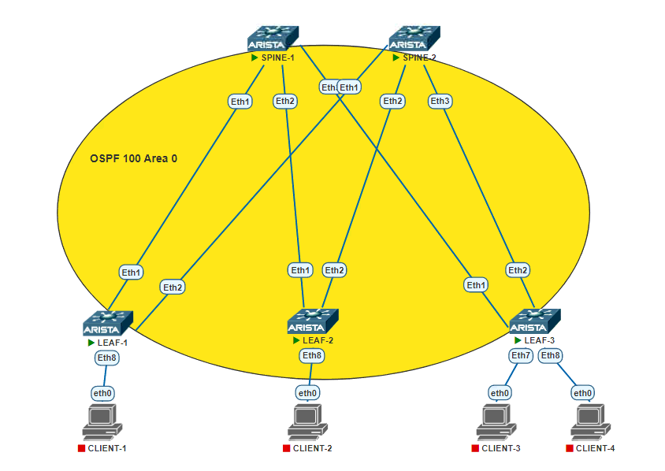

### TASK-2

## Underlay. OSPF

### Задача:

- Настроить протокол OSPF для Underlay сети
- Проверить связанность между устройствами

## Выполнение:

### Схема сети

### Конфигурация оборудования

- #### [leaf-1](conf/leaf-1.txt)
