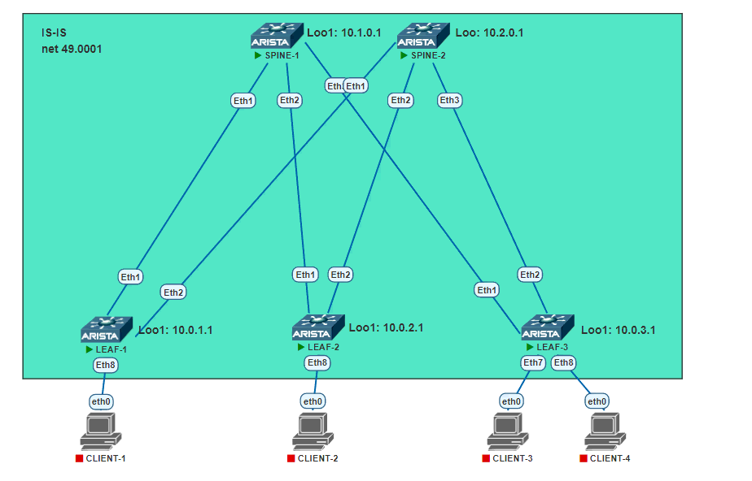

# TASK-3

## Underlay. IS-IS

### Задача:

- Настроить протокол IS-IS для Underlay сети
- Проверить связанность между устройствами

## Выполнение:

### Схема сети



### Конфигурация оборудования

- #### [leaf-1](conf/leaf-1.conf)

```
!
interface Ethernet1
   description TO_SPINE-1
   no switchport
   ip address 10.1.1.1/31
   bfd interval 100 min-rx 100 multiplier 3
   isis enable UNDERLAY
   isis bfd
   isis circuit-type level-1
   isis network point-to-point
   isis authentication mode md5
   isis authentication key 7 Qyo102yW8zI=
!
interface Ethernet2
   description TO_SPINE-2
   no switchport
   ip address 10.2.1.1/31
   bfd interval 100 min-rx 100 multiplier 3
   isis enable UNDERLAY
   isis bfd
   isis circuit-type level-1
   isis network point-to-point
   isis authentication mode md5
   isis authentication key 7 Qyo102yW8zI=
!
!
interface Loopback1
   description UNDERLAY
   ip address 10.0.1.1/32
   isis enable UNDERLAY
!
router isis UNDERLAY
   net 49.0001.0100.0100.1001.00
   is-type level-1
   !
   address-family ipv4 unicast
!
```

- #### [leaf-2](conf/leaf-2.conf)

```
!
interface Ethernet1
   description TO_SPINE-1
   no switchport
   ip address 10.1.2.1/31
   bfd interval 100 min-rx 100 multiplier 3
   isis enable UNDERLAY
   isis bfd
   isis circuit-type level-1
   isis network point-to-point
   isis authentication mode md5
   isis authentication key 7 Qyo102yW8zI=
!
interface Ethernet2
   description TO_SPINE-2
   no switchport
   ip address 10.2.2.1/31
   bfd interval 100 min-rx 100 multiplier 3
   isis enable UNDERLAY
   isis bfd
   isis circuit-type level-1
   isis network point-to-point
   isis authentication mode md5
   isis authentication key 7 Qyo102yW8zI=
!
!
interface Loopback1
   description UNDERLAY
   ip address 10.0.2.1/32
   isis enable UNDERLAY
!
router isis UNDERLAY
   net 49.0001.0100.0100.1002.00
   is-type level-1
   !
   address-family ipv4 unicast
!
```

- #### [leaf-3](conf/leaf-3.conf)

```
!
interface Ethernet1
   description TO_SPINE-1
   no switchport
   ip address 10.1.3.1/31
   bfd interval 100 min-rx 100 multiplier 3
   isis enable UNDERLAY
   isis bfd
   isis circuit-type level-1
   isis network point-to-point
   isis authentication mode md5
   isis authentication key 7 Qyo102yW8zI=
!
interface Ethernet2
   description TO_SPINE-2
   no switchport
   ip address 10.2.3.1/31
   bfd interval 100 min-rx 100 multiplier 3
   isis enable UNDERLAY
   isis bfd
   isis circuit-type level-1
   isis network point-to-point
   isis authentication mode md5
   isis authentication key 7 Qyo102yW8zI=
!
!
interface Loopback1
   description UNDERLAY
   ip address 10.0.3.1/32
   isis enable UNDERLAY
!
router isis UNDERLAY
   net 49.0001.0100.0100.1003.00
   is-type level-1
   !
   address-family ipv4 unicast
!
```

- #### [spine-1](conf/spine-1.conf)

```
!
interface Ethernet1
   description TO_LEAF-1
   no switchport
   ip address 10.1.1.0/31
   bfd interval 100 min-rx 100 multiplier 3
   isis enable UNDERLAY
   isis bfd
   isis circuit-type level-1
   isis network point-to-point
   isis authentication mode md5
   isis authentication key 7 Qyo102yW8zI=
!
interface Ethernet2
   description TO_LEAF-2
   no switchport
   ip address 10.1.2.0/31
   bfd interval 100 min-rx 100 multiplier 3
   isis enable UNDERLAY
   isis bfd
   isis circuit-type level-1
   isis network point-to-point
   isis authentication mode md5
   isis authentication key 7 Qyo102yW8zI=
!
interface Ethernet3
   description TO_LEAF-3
   no switchport
   ip address 10.1.3.0/31
   bfd interval 100 min-rx 100 multiplier 3
   isis enable UNDERLAY
   isis bfd
   isis circuit-type level-1
   isis network point-to-point
   isis authentication mode md5
   isis authentication key 7 Qyo102yW8zI=
!
interface Loopback1
   description UNDERLAY
   ip address 10.1.0.1/32
   isis enable UNDERLAY
!
router isis UNDERLAY
   net 49.0001.0100.0100.0001.00
   is-type level-1
   !
   address-family ipv4 unicast
!
```

- #### [spine-2](conf/spine-2.conf)

```
!
interface Ethernet1
   description TO_LEAF-1
   no switchport
   ip address 10.2.1.0/31
   bfd interval 100 min-rx 100 multiplier 3
   isis enable UNDERLAY
   isis bfd
   isis circuit-type level-1
   isis network point-to-point
   isis authentication mode md5
   isis authentication key 7 Qyo102yW8zI=
!
interface Ethernet2
   description TO_LEAF-2
   no switchport
   ip address 10.2.2.0/31
   bfd interval 100 min-rx 100 multiplier 3
   isis enable UNDERLAY
   isis bfd
   isis circuit-type level-1
   isis network point-to-point
   isis authentication mode md5
   isis authentication key 7 Qyo102yW8zI=
!
interface Ethernet3
   description TO_LEAF-3
   no switchport
   ip address 10.2.3.0/31
   bfd interval 100 min-rx 100 multiplier 3
   isis enable UNDERLAY
   isis bfd
   isis circuit-type level-1
   isis network point-to-point
   isis authentication mode md5
   isis authentication key 7 Qyo102yW8zI=
!
interface Loopback1
   description UNDERLAY
   ip address 10.2.0.1/32
   isis enable UNDERLAY
!
router isis UNDERLAY
   net 49.0001.0100.0100.0002.00
   is-type level-1
   !
   address-family ipv4 unicast
!
```

### Проверка связанности устройств по протоколу IS-IS

- #### spine-1

```
SPINE-1#show isis neighbors 
 
Instance  VRF      System Id        Type Interface          SNPA              State Hold time   Circuit Id          
UNDERLAY  default  LEAF-1           L1   Ethernet1          P2P               UP    29          0D                  
UNDERLAY  default  LEAF-2           L1   Ethernet2          P2P               UP    27          0D                  
UNDERLAY  default  LEAF-3           L1   Ethernet3          P2P               UP    23          0D                  
SPINE-1#show ip route isis

 I L1     10.0.1.1/32 [115/20] via 10.1.1.1, Ethernet1
 I L1     10.0.2.1/32 [115/20] via 10.1.2.1, Ethernet2
 I L1     10.0.3.1/32 [115/20] via 10.1.3.1, Ethernet3
 I L1     10.2.0.1/32 [115/30] via 10.1.1.1, Ethernet1
                               via 10.1.2.1, Ethernet2
 I L1     10.2.1.0/31 [115/20] via 10.1.1.1, Ethernet1
 I L1     10.2.2.0/31 [115/20] via 10.1.2.1, Ethernet2
 I L1     10.2.3.0/31 [115/20] via 10.1.3.1, Ethernet3

```

- #### spine-2

```
SPINE-2#sho isis neighbors 
 
Instance  VRF      System Id        Type Interface          SNPA              State Hold time   Circuit Id          
UNDERLAY  default  LEAF-1           L1   Ethernet1          P2P               UP    29          0E                  
UNDERLAY  default  LEAF-2           L1   Ethernet2          P2P               UP    21          0E                  
UNDERLAY  default  LEAF-3           L1   Ethernet3          P2P               UP    25          0E                  
SPINE-2#sho ip ro isis 

 I L1     10.0.1.1/32 [115/20] via 10.2.1.1, Ethernet1
 I L1     10.0.2.1/32 [115/20] via 10.2.2.1, Ethernet2
 I L1     10.0.3.1/32 [115/20] via 10.2.3.1, Ethernet3
 I L1     10.1.0.1/32 [115/30] via 10.2.1.1, Ethernet1
                               via 10.2.2.1, Ethernet2
                               via 10.2.3.1, Ethernet3
 I L1     10.1.1.0/31 [115/20] via 10.2.1.1, Ethernet1
 I L1     10.1.2.0/31 [115/20] via 10.2.2.1, Ethernet2
 I L1     10.1.3.0/31 [115/20] via 10.2.3.1, Ethernet3
```

