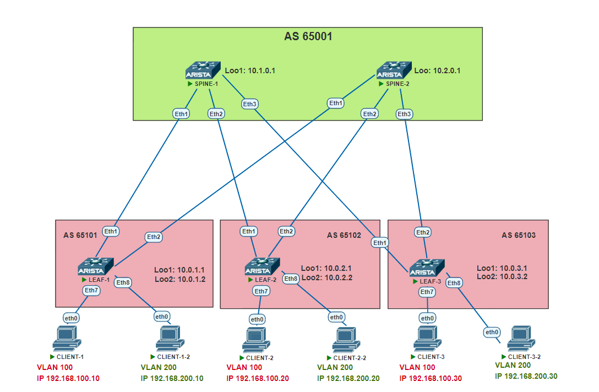

# TASK 5

## Overlay. VxLAN EVPN L2

### Задача:

- Настроить BGP peering между Leaf и Spine в AF l2vpn evpn
- Проверить связанность между клиентами

## Выполнение:

### Схема сети



### Конфигурация оборудования

- #### [leaf-1](config/leaf-1.conf)

```

```

- #### [leaf-2](config/leaf-2.conf)

```

```

- #### [leaf-3](config/leaf-3.conf)

```

```

- #### [spine-1](config/spine-1.conf)

```

```

- #### [spine-2](config/spine-2.conf)

```

```

### Проверка связанности клиентов по L2

- #### spine-1

```

```

- #### spine-2

```

```

- #### leaf-1

```

```

- #### client-1

```

```

- #### client-1-2

```

```
