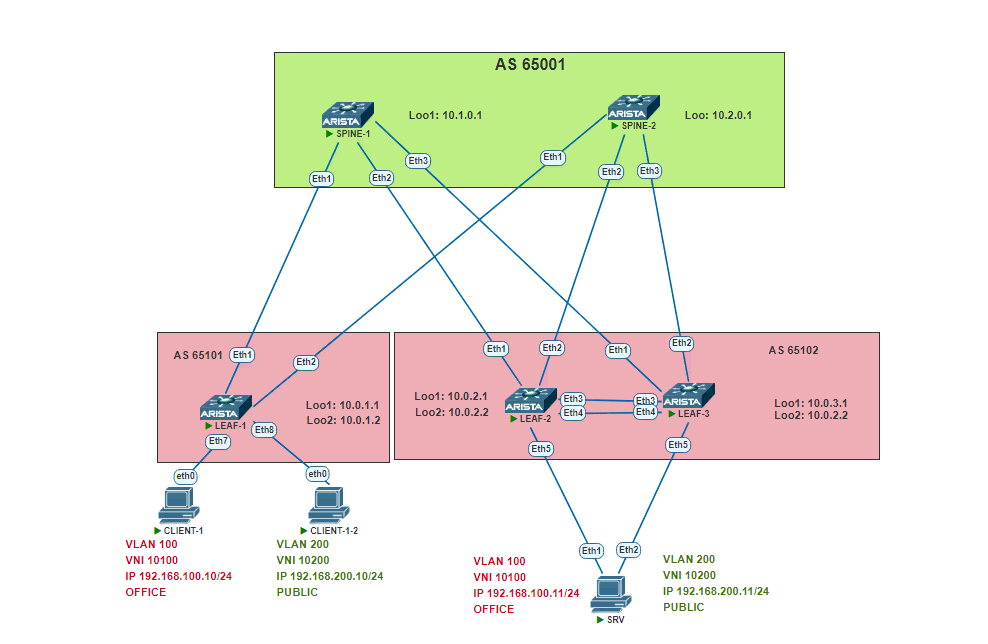

# TASK 7

## Overlay. VxLAN VPC

### Задача:

- Подключить клиентов 2-я линками к разным Leaf
- Настроить агрегированный канал со стороны клиента 
- Настроить VPC для работы в Overlay сети
- Проверить связанность между клиентами

## Выполнение:

### Схема сети



### Конфигурация оборудования

- #### [leaf-1](config/leaf-1.conf)

```
```

- #### [leaf-2](config/leaf-2.conf)

```
```

- #### [leaf-3](config/leaf-3.conf)

```
```

- #### [SRV](config/SRV.conf)

```
```

### Проверка связанности клиентов по L3

- #### leaf-2

```
```

- #### leaf-3

```
```

- #### SRV

```
```

- #### CLIENT-1

```
```
