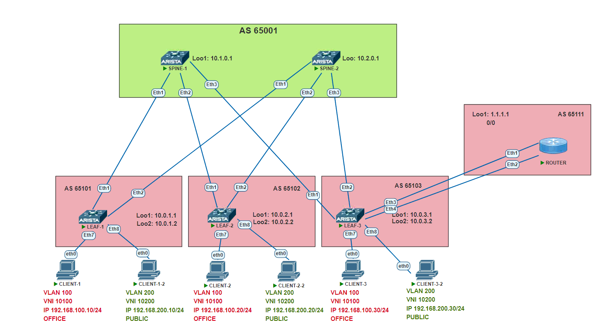

# TASK 8

## Overlay. VxLAN Оптимизация таблиц маршрутизации 

### Задача:

- Анонсировать префиксы разных VRF клиентов в Overlay сети через отдельный роутер
- Проверить связанность между клиентами

## Выполнение:

### Схема сети



### Конфигурация оборудования

- #### [leaf-1](conf/leaf-1.conf)

```
!
vrf instance OFFICE
!
vrf instance PUBLIC
!
interface Ethernet1
   description TO_SPINE-1
   no switchport
   ip address 10.1.1.1/31
!
interface Ethernet2
   description TO_SPINE-2
   no switchport
   ip address 10.2.1.1/31
!
interface Ethernet3
!
interface Ethernet4
!
interface Ethernet5
!
interface Ethernet6
!
interface Ethernet7
   description TO_CLIENT-1
   switchport access vlan 100
!
interface Ethernet8
   description TO_CLIENT-1-2
   switchport access vlan 200
!
interface Ethernet102
!
interface Loopback1
   description UNDERLAY
   ip address 10.0.1.1/32
!
interface Loopback2
   description OVERLAY
   ip address 10.0.1.2/32
!
interface Management1
!
interface Vlan100
   description OFFICE
   vrf OFFICE
   ip address 192.168.100.1/24
!
interface Vlan200
   description PUBLIC
   vrf PUBLIC
   ip address 192.168.200.1/24
!
interface Vxlan1
   vxlan source-interface Loopback2
   vxlan udp-port 4789
   vxlan vlan 100 vni 10100
   vxlan vlan 200 vni 10200
   vxlan vrf OFFICE vni 11
   vxlan vrf PUBLIC vni 12
!
ip virtual-router mac-address 00:00:00:00:00:0a
!
ip routing
ip routing vrf OFFICE
ip routing vrf PUBLIC
!
ip prefix-list PL_LOOPBACK
   seq 10 permit 10.0.1.1/32
   seq 20 permit 10.0.1.2/32
!
route-map RM_CONNECTED permit 10
   match ip address prefix-list PL_LOOPBACK
!
router bgp 65101
   router-id 10.0.1.1
   timers bgp 3 9
   maximum-paths 5 ecmp 5
   neighbor L2EVPN peer group
   neighbor L2EVPN remote-as 65001
   neighbor L2EVPN update-source Loopback1
   neighbor L2EVPN ebgp-multihop 3
   neighbor L2EVPN send-community extended
   neighbor SPINES peer group
   neighbor SPINES remote-as 65001
   neighbor SPINES bfd
   neighbor SPINES allowas-in 1
   neighbor SPINES rib-in pre-policy retain all
   neighbor SPINES password 7 wMeqR2znTcw=
   neighbor SPINES send-community
   neighbor SPINES maximum-routes 1000
   neighbor 10.1.0.1 peer group L2EVPN
   neighbor 10.1.1.0 peer group SPINES
   neighbor 10.2.0.1 peer group L2EVPN
   neighbor 10.2.1.0 peer group SPINES
   redistribute connected route-map RM_CONNECTED
   !
   vlan 100
      rd 65101:10100
      route-target both 100:100
      redistribute learned
   !
   vlan 200
      rd 65101:10200
      route-target both 200:200
      redistribute learned
   !
   address-family evpn
      neighbor L2EVPN activate
   !
   address-family ipv4
      neighbor SPINES activate
   !
   vrf OFFICE
      rd 65101:11
      route-target import evpn 11:11
      route-target export evpn 11:11
      redistribute connected
   !
   vrf PUBLIC
      rd 65101:12
      route-target import evpn 12:12
      route-target export evpn 12:12
      redistribute connected
!
end

```


- #### [leaf-2](conf/leaf-2.conf)

```
!
vrf instance OFFICE
!
vrf instance PUBLIC
!
interface Ethernet1
   description TO_SPINE-1
   no switchport
   ip address 10.1.2.1/31
!
interface Ethernet2
   description TO_SPINE-2
   no switchport
   ip address 10.2.2.1/31
!
interface Ethernet3
!
interface Ethernet4
!
interface Ethernet5
!
interface Ethernet6
!
interface Ethernet7
   description TO_CLIENT-2
   switchport access vlan 100
!
interface Ethernet8
   description TO_CLIENT-2-2
   switchport access vlan 200
!
interface Loopback1
   description UNDERLAY
   ip address 10.0.2.1/32
!
interface Loopback2
   description OVERLAY
   ip address 10.0.2.2/32
!
interface Management1
!
interface Vlan100
   description OFFICE
   vrf OFFICE
   ip address 192.168.100.1/24
!
interface Vlan200
   description PUBLIC
   vrf PUBLIC
   ip address 192.168.200.1/24
!
interface Vxlan1
   vxlan source-interface Loopback2
   vxlan udp-port 4789
   vxlan vlan 100 vni 10100
   vxlan vlan 200 vni 10200
   vxlan vrf OFFICE vni 11
   vxlan vrf PUBLIC vni 12
!
ip virtual-router mac-address 00:00:00:00:00:0b
!
ip routing
ip routing vrf OFFICE
ip routing vrf PUBLIC
!
ip prefix-list PL_LOOPBACK
   seq 10 permit 10.0.2.1/32
   seq 20 permit 10.0.2.2/32
!
route-map RM_CONNECTED permit 10
   match ip address prefix-list PL_LOOPBACK
!
router bgp 65102
   router-id 10.0.2.1
   timers bgp 3 9
   maximum-paths 5 ecmp 5
   neighbor L2EVPN peer group
   neighbor L2EVPN remote-as 65001
   neighbor L2EVPN update-source Loopback1
   neighbor L2EVPN ebgp-multihop 3
   neighbor L2EVPN send-community extended
   neighbor SPINES peer group
   neighbor SPINES remote-as 65001
   neighbor SPINES bfd
   neighbor SPINES allowas-in 1
   neighbor SPINES rib-in pre-policy retain all
   neighbor SPINES password 7 wMeqR2znTcw=
   neighbor SPINES send-community
   neighbor SPINES maximum-routes 1000
   neighbor 10.1.0.1 peer group L2EVPN
   neighbor 10.1.2.0 peer group SPINES
   neighbor 10.2.0.1 peer group L2EVPN
   neighbor 10.2.2.0 peer group SPINES
   redistribute connected route-map RM_CONNECTED
   !
   vlan 100
      rd 65102:10100
      route-target both 100:100
      redistribute learned
   !
   vlan 200
      rd 65102:10200
      route-target both 200:200
      redistribute learned
   !
   address-family evpn
      neighbor L2EVPN activate
   !
   address-family ipv4
      neighbor SPINES activate
   !
   vrf OFFICE
      rd 65102:11
      route-target import evpn 11:11
      route-target export evpn 11:11
      redistribute connected
   !
   vrf PUBLIC
      rd 65102:12
      route-target import evpn 12:12
      route-target export evpn 12:12
      redistribute connected
!
end
```

- #### [leaf-3](conf/leaf-3.conf)

```
!
vrf instance OFFICE
!
vrf instance PUBLIC
!
interface Ethernet1
   description TO_SPINE-1
   no switchport
   ip address 10.1.3.1/31
!
interface Ethernet2
   description TO_SPINE-2
   no switchport
   ip address 10.2.3.1/31
!
interface Ethernet3
   description OFFICE_LINK
   no switchport
   vrf OFFICE
   ip address 10.0.0.0/31
!
interface Ethernet4
   description PUBLIC_LINK
   no switchport
   vrf PUBLIC
   ip address 10.0.0.2/31
!
interface Ethernet5
!
interface Ethernet6
!
interface Ethernet7
   description TO_CLIENT-3
   switchport access vlan 100
!
interface Ethernet8
   description TO_CLIENT-3-2
   switchport access vlan 200
!
interface Loopback1
   description UNDERLAY
   ip address 10.0.3.1/32
!
interface Loopback2
   description OVERLAY
   ip address 10.0.3.2/32
!
interface Management1
!
interface Vlan100
   description OFFICE
   vrf OFFICE
   ip address 192.168.100.1/24
!
interface Vlan200
   description PUBLIC
   vrf PUBLIC
   ip address 192.168.200.1/24
!
interface Vxlan1
   vxlan source-interface Loopback2
   vxlan udp-port 4789
   vxlan vlan 100 vni 10100
   vxlan vlan 200 vni 10200
   vxlan vrf OFFICE vni 11
   vxlan vrf PUBLIC vni 12
!
ip virtual-router mac-address 00:00:00:00:00:0c
!
ip routing
ip routing vrf MULTICARTA
ip routing vrf OFFICE
ip routing vrf PUBLIC
!
ip prefix-list PL_LOOPBACK
   seq 10 permit 10.0.3.1/32
   seq 20 permit 10.0.3.2/32
!
route-map RM_CONNECTED permit 10
   match ip address prefix-list PL_LOOPBACK
!
router bgp 65103
   router-id 10.0.3.1
   timers bgp 3 9
   maximum-paths 5 ecmp 5
   neighbor L2EVPN peer group
   neighbor L2EVPN remote-as 65001
   neighbor L2EVPN update-source Loopback1
   neighbor L2EVPN ebgp-multihop 3
   neighbor L2EVPN send-community extended
   neighbor SPINES peer group
   neighbor SPINES remote-as 65001
   neighbor SPINES bfd
   neighbor SPINES allowas-in 1
   neighbor SPINES rib-in pre-policy retain all
   neighbor SPINES password 7 wMeqR2znTcw=
   neighbor SPINES send-community
   neighbor SPINES maximum-routes 1000
   neighbor 10.0.0.1 bfd
   neighbor 10.0.0.3 bfd
   neighbor 10.1.0.1 peer group L2EVPN
   neighbor 10.1.3.0 peer group SPINES
   neighbor 10.2.0.1 peer group L2EVPN
   neighbor 10.2.3.0 peer group SPINES
   redistribute connected route-map RM_CONNECTED
   !
   vlan 100
      rd 65103:10100
      route-target both 100:100
      redistribute learned
   !
   vlan 200
      rd 65103:10200
      route-target both 200:200
      redistribute learned
   !
   address-family evpn
      neighbor L2EVPN activate
   !
   address-family ipv4
      neighbor SPINES activate
   !
   vrf OFFICE
      rd 65103:11
      route-target import evpn 11:11
      route-target export evpn 11:11
      neighbor 10.0.0.1 remote-as 65111
      redistribute connected
      !
      address-family ipv4
         neighbor 10.0.0.1 activate
   !
   vrf PUBLIC
      rd 65103:12
      route-target import evpn 12:12
      route-target export evpn 12:12
      neighbor 10.0.0.3 remote-as 65111
      redistribute connected
      !
      address-family ipv4
         neighbor 10.0.0.3 activate
!
end
```

- #### [ROUTER](conf/ROUTER.conf)

```
!
hostname ROUTER
!
interface Ethernet1
   description OFFICE_LINK
   no switchport
   ip address 10.0.0.1/31
!
interface Ethernet2
   description PUBLIC_LINK
   no switchport
   ip address 10.0.0.3/31
!
interface Loopback1
   ip address 1.1.1.1/32
!
ip routing
!
ip route 0.0.0.0/0 Null0
!
router bgp 65111
   timers bgp 3 9
   neighbor 10.0.0.0 remote-as 65103
   neighbor 10.0.0.2 remote-as 65103
   redistribute connected
   redistribute static
   !
   address-family ipv4
      neighbor 10.0.0.0 activate
      neighbor 10.0.0.2 activate
!
end
```


### Проверка связанности клиентов по L3

- #### CLIENT-1

```
VPCS> ping 192.168.200.30

84 bytes from 192.168.200.30 icmp_seq=1 ttl=61 time=358.564 ms
84 bytes from 192.168.200.30 icmp_seq=2 ttl=60 time=49.917 ms
84 bytes from 192.168.200.30 icmp_seq=3 ttl=60 time=62.788 ms
84 bytes from 192.168.200.30 icmp_seq=4 ttl=60 time=84.509 ms
84 bytes from 192.168.200.30 icmp_seq=5 ttl=60 time=77.913 ms

VPCS> ping 192.168.100.30

84 bytes from 192.168.100.30 icmp_seq=1 ttl=64 time=71.570 ms
84 bytes from 192.168.100.30 icmp_seq=2 ttl=64 time=71.053 ms
84 bytes from 192.168.100.30 icmp_seq=3 ttl=64 time=59.216 ms
84 bytes from 192.168.100.30 icmp_seq=4 ttl=64 time=63.773 ms
84 bytes from 192.168.100.30 icmp_seq=5 ttl=64 time=119.617 ms

VPCS> ping 192.168.100.20

84 bytes from 192.168.100.20 icmp_seq=1 ttl=64 time=57.022 ms
84 bytes from 192.168.100.20 icmp_seq=2 ttl=64 time=37.525 ms
84 bytes from 192.168.100.20 icmp_seq=3 ttl=64 time=33.390 ms
84 bytes from 192.168.100.20 icmp_seq=4 ttl=64 time=39.841 ms
84 bytes from 192.168.100.20 icmp_seq=5 ttl=64 time=39.874 ms

VPCS> ping 192.168.200.20

84 bytes from 192.168.200.20 icmp_seq=1 ttl=60 time=266.274 ms
84 bytes from 192.168.200.20 icmp_seq=2 ttl=60 time=129.990 ms
84 bytes from 192.168.200.20 icmp_seq=3 ttl=60 time=154.792 ms
84 bytes from 192.168.200.20 icmp_seq=4 ttl=60 time=111.413 ms
84 bytes from 192.168.200.20 icmp_seq=5 ttl=60 time=127.341 ms

VPCS> ping 1.1.1.1

84 bytes from 1.1.1.1 icmp_seq=1 ttl=62 time=65.427 ms
84 bytes from 1.1.1.1 icmp_seq=2 ttl=62 time=82.469 ms
84 bytes from 1.1.1.1 icmp_seq=3 ttl=62 time=57.772 ms
84 bytes from 1.1.1.1 icmp_seq=4 ttl=62 time=65.317 ms
84 bytes from 1.1.1.1 icmp_seq=5 ttl=62 time=54.285 ms

```

- #### LEAF-1

```
LEAF-1#sho ip route vrf all

VRF: default


 C        10.0.1.1/32 is directly connected, Loopback1
 C        10.0.1.2/32 is directly connected, Loopback2
 B E      10.0.2.1/32 [200/0] via 10.1.1.0, Ethernet1
                              via 10.2.1.0, Ethernet2
 B E      10.0.2.2/32 [200/0] via 10.1.1.0, Ethernet1
                              via 10.2.1.0, Ethernet2
 B E      10.0.3.1/32 [200/0] via 10.1.1.0, Ethernet1
                              via 10.2.1.0, Ethernet2
 B E      10.0.3.2/32 [200/0] via 10.1.1.0, Ethernet1
                              via 10.2.1.0, Ethernet2
 B E      10.1.0.1/32 [200/0] via 10.1.1.0, Ethernet1
 C        10.1.1.0/31 is directly connected, Ethernet1
 B E      10.2.0.1/32 [200/0] via 10.2.1.0, Ethernet2
 C        10.2.1.0/31 is directly connected, Ethernet2


VRF: OFFICE

Gateway of last resort:
 B E      0.0.0.0/0 [200/0] via VTEP 10.0.3.2 VNI 11 router-mac 50:78:66:5e:44:b6 local-interface Vxlan1

 B E      1.1.1.1/32 [200/0] via VTEP 10.0.3.2 VNI 11 router-mac 50:78:66:5e:44:b6 local-interface Vxlan1
 B E      10.0.0.0/31 [200/0] via VTEP 10.0.3.2 VNI 11 router-mac 50:78:66:5e:44:b6 local-interface Vxlan
1
 B E      10.0.0.2/31 [200/0] via VTEP 10.0.3.2 VNI 11 router-mac 50:78:66:5e:44:b6 local-interface Vxlan
1
 B E      192.168.100.20/32 [200/0] via VTEP 10.0.2.2 VNI 11 router-mac 50:19:80:b2:e2:8c local-interface
 Vxlan1
 B E      192.168.100.30/32 [200/0] via VTEP 10.0.3.2 VNI 11 router-mac 50:78:66:5e:44:b6 local-interface
 Vxlan1
 C        192.168.100.0/24 is directly connected, Vlan100


VRF: PUBLIC


Gateway of last resort:
 B E      0.0.0.0/0 [200/0] via VTEP 10.0.3.2 VNI 12 router-mac 50:78:66:5e:44:b6 local-interface Vxlan1

 B E      1.1.1.1/32 [200/0] via VTEP 10.0.3.2 VNI 12 router-mac 50:78:66:5e:44:b6 local-interface Vxlan1
 B E      10.0.0.0/31 [200/0] via VTEP 10.0.3.2 VNI 12 router-mac 50:78:66:5e:44:b6 local-interface Vxlan
1
 B E      10.0.0.2/31 [200/0] via VTEP 10.0.3.2 VNI 12 router-mac 50:78:66:5e:44:b6 local-interface Vxlan
1
 B E      192.168.200.20/32 [200/0] via VTEP 10.0.2.2 VNI 12 router-mac 50:19:80:b2:e2:8c local-interface
 Vxlan1
 B E      192.168.200.30/32 [200/0] via VTEP 10.0.3.2 VNI 12 router-mac 50:78:66:5e:44:b6 local-interface
 Vxlan1
 C        192.168.200.0/24 is directly connected, Vlan200

LEAF-1#sho vxlan vni 
VNI to VLAN Mapping for Vxlan1
VNI         VLAN       Source       Interface       802.1Q Tag
----------- ---------- ------------ --------------- ----------
10100       100        static       Ethernet7       untagged  
                                    Vxlan1          100       
10200       200        static       Ethernet8       untagged  
                                    Vxlan1          200       

VNI to dynamic VLAN Mapping for Vxlan1
VNI       VLAN       VRF          Source       
--------- ---------- ------------ ------------ 
11        4093       OFFICE       evpn         
12        4092       PUBLIC       evpn         

LEAF-1#sho vxlan vtep 
Remote VTEPS for Vxlan1:

VTEP           Tunnel Type(s)
-------------- --------------
10.0.2.2       flood, unicast
10.0.3.2       flood, unicast


LEAF-1#sho bgp evpn route-type ip-prefix ipv4 


          Network                Next Hop              Metric  LocPref Weight  Path
 * >Ec    RD: 65103:11 ip-prefix 0.0.0.0/0
                                 10.0.3.2              -       100     0       65001 65103 65111 ?
 *  ec    RD: 65103:11 ip-prefix 0.0.0.0/0
                                 10.0.3.2              -       100     0       65001 65103 65111 ?
 * >Ec    RD: 65103:12 ip-prefix 0.0.0.0/0
                                 10.0.3.2              -       100     0       65001 65103 65111 ?
 *  ec    RD: 65103:12 ip-prefix 0.0.0.0/0
                                 10.0.3.2              -       100     0       65001 65103 65111 ?
* >Ec    RD: 65103:11 ip-prefix 1.1.1.1/32
                                 10.0.3.2              -       100     0       65001 65103 65111 i
 *  ec    RD: 65103:11 ip-prefix 1.1.1.1/32
                                 10.0.3.2              -       100     0       65001 65103 65111 i
 * >Ec    RD: 65103:12 ip-prefix 1.1.1.1/32
                                 10.0.3.2              -       100     0       65001 65103 65111 i
 *  ec    RD: 65103:12 ip-prefix 1.1.1.1/32
                                 10.0.3.2              -       100     0       65001 65103 65111 i
 * >Ec    RD: 65103:11 ip-prefix 10.0.0.0/31
                                 10.0.3.2              -       100     0       65001 65103 i
 *  ec    RD: 65103:11 ip-prefix 10.0.0.0/31
                                 10.0.3.2              -       100     0       65001 65103 i
 * >Ec    RD: 65103:12 ip-prefix 10.0.0.0/31
                                 10.0.3.2              -       100     0       65001 65103 65111 i
 *  ec    RD: 65103:12 ip-prefix 10.0.0.0/31
                                 10.0.3.2              -       100     0       65001 65103 65111 i
 * >Ec    RD: 65103:11 ip-prefix 10.0.0.2/31
                                 10.0.3.2              -       100     0       65001 65103 65111 i
 *  ec    RD: 65103:11 ip-prefix 10.0.0.2/31
                                 10.0.3.2              -       100     0       65001 65103 65111 i
 * >Ec    RD: 65103:12 ip-prefix 10.0.0.2/31
                                 10.0.3.2              -       100     0       65001 65103 i
 *  ec    RD: 65103:12 ip-prefix 10.0.0.2/31
                                 10.0.3.2              -       100     0       65001 65103 i
 * >      RD: 65101:11 ip-prefix 192.168.100.0/24
                                 -                     -       -       0       i
 * >Ec    RD: 65102:11 ip-prefix 192.168.100.0/24
                                 10.0.2.2              -       100     0       65001 65102 i
 *  ec    RD: 65102:11 ip-prefix 192.168.100.0/24
                                 10.0.2.2              -       100     0       65001 65102 i
 * >Ec    RD: 65103:11 ip-prefix 192.168.100.0/24
                                 10.0.3.2              -       100     0       65001 65103 i
 *  ec    RD: 65103:11 ip-prefix 192.168.100.0/24
                                 10.0.3.2              -       100     0       65001 65103 i
 * >      RD: 65101:12 ip-prefix 192.168.200.0/24
                                 -                     -       -       0       i
 * >Ec    RD: 65102:12 ip-prefix 192.168.200.0/24
                                 10.0.2.2              -       100     0       65001 65102 i
 *  ec    RD: 65102:12 ip-prefix 192.168.200.0/24
                                 10.0.2.2              -       100     0       65001 65102 i
 * >Ec    RD: 65103:12 ip-prefix 192.168.200.0/24
                                 10.0.3.2              -       100     0       65001 65103 i
 *  ec    RD: 65103:12 ip-prefix 192.168.200.0/24
                                 10.0.3.2              -       100     0       65001 65103 


LEAF-1#sho int vxlan 1
Vxlan1 is up, line protocol is up (connected)
  Hardware is Vxlan
  Source interface is Loopback2 and is active with 10.0.1.2
  Listening on UDP port 4789
  Replication/Flood Mode is headend with Flood List Source: EVPN
  Remote MAC learning via EVPN
  VNI mapping to VLANs
  Static VLAN to VNI mapping is 
    [100, 10100]      [200, 10200]     
  Dynamic VLAN to VNI mapping for 'evpn' is
    [4092, 12]        [4093, 11]       
  Note: All Dynamic VLANs used by VCS are internal VLANs.
        Use 'show vxlan vni' for details.
  Static VRF to VNI mapping is 
   [OFFICE, 11]
   [PUBLIC, 12]
  Headend replication flood vtep list is:
   100 10.0.2.2        10.0.3.2       
   200 10.0.2.2        10.0.3.2       
  Shared Router MAC is 0000.0000.0000
```

- #### ROUTER

```
ROUTER#sho ip bgp neighbors 10.0.0.0 advertised-routes 
BGP routing table information for VRF default
Router identifier 10.0.0.3, local AS number 65111
Route status codes: * - valid, > - active, # - not installed, E - ECMP head, e - ECMP
                    S - Stale, c - Contributing to ECMP, b - backup, L - labeled-unicast
Origin codes: i - IGP, e - EGP, ? - incomplete
AS Path Attributes: Or-ID - Originator ID, C-LST - Cluster List, LL Nexthop - Link Local Nexthop

         Network                Next Hop            Metric  LocPref Weight  Path
 * >     0.0.0.0/0              10.0.0.1              -       -       -       65111 ?
 * >     1.1.1.1/32             10.0.0.1              -       -       -       65111 i
 * >     10.0.0.0/31            10.0.0.1              -       -       -       65111 i
 * >     10.0.0.2/31            10.0.0.1              -       -       -       65111 i
 * >     192.168.200.0/24       10.0.0.1              -       -       -       65111 65103 i

ROUTER#sho ip bgp neighbors 10.0.0.2 advertised-routes
BGP routing table information for VRF default
Router identifier 10.0.0.3, local AS number 65111
Route status codes: * - valid, > - active, # - not installed, E - ECMP head, e - ECMP
                    S - Stale, c - Contributing to ECMP, b - backup, L - labeled-unicast
Origin codes: i - IGP, e - EGP, ? - incomplete
AS Path Attributes: Or-ID - Originator ID, C-LST - Cluster List, LL Nexthop - Link Local Nexthop

         Network                Next Hop            Metric  LocPref Weight  Path
 * >     0.0.0.0/0              10.0.0.3              -       -       -       65111 ?
 * >     1.1.1.1/32             10.0.0.3              -       -       -       65111 i
 * >     10.0.0.0/31            10.0.0.3              -       -       -       65111 i
 * >     10.0.0.2/31            10.0.0.3              -       -       -       65111 i
 * >     192.168.100.0/24       10.0.0.3              -       -       -       65111 65103 i
```
